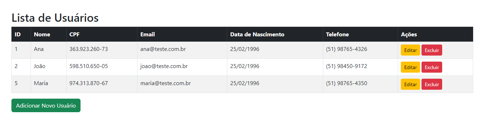

# CRUD PHP com MySQL

## Tecnologias utilizadas
- ✅ PHP 8.2
- ✅ MySQL 8.0
- ✅ Bootstrap 5.3
- ✅ Composer 
- ✅ Docker

## :rocket: Instalação e uso
1. Clone o repositório
```
$ git clone https://github.com/Guilhermebit/crud-php-mysql.git
```
2. Instale o Docker: https://docs.docker.com/engine/install/
3. Execute o seguinte comando:
```
docker-compose up --build
```
4. O Projeto vai ser acessível em: http://localhost:8080
5. O phpMyAdmin vai ser acessível em: http://localhost:8081

## Script SQL
Este projeto inclui um script [SQL](Contents/schema.sql) para auxiliar nos testes.

## Observações
Já que o cpf precisa ser cadastrado em um formato válido utilizei esse site para fazer a geração: https://www.4devs.com.br/gerador_de_cpf

## O Projeto será conforme visto abaixo: 


